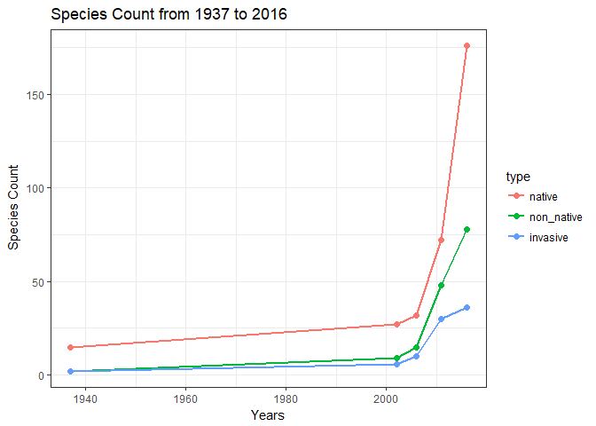
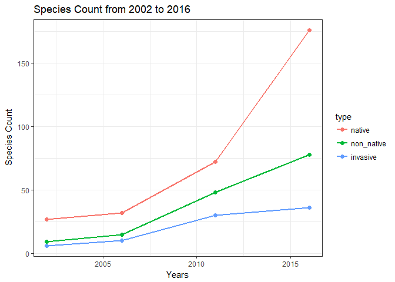
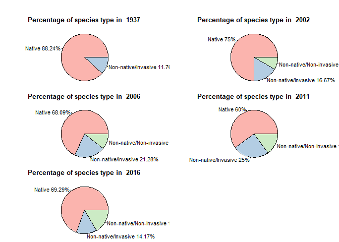
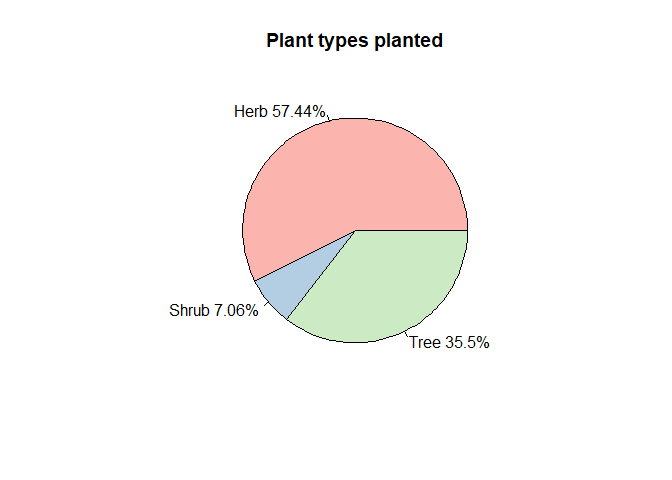
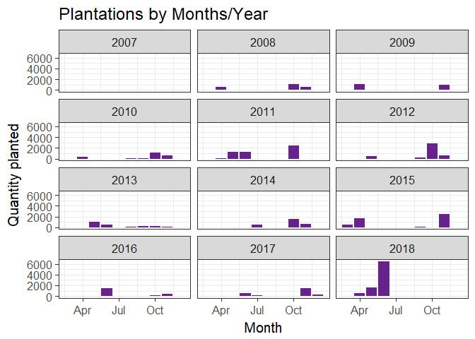

Analysis using R
================

-   [New York Botanical Garden Analysis](#new-york-botanical-garden-analysis)
    -   [1. Trend in number of native, non-native and invasive species over the years](#trend-in-number-of-native-non-native-and-invasive-species-over-the-years)
        -   [1.1. Reshaping the source table](#reshaping-the-source-table)
        -   [1.2. Plotting the number of species types by survey years](#plotting-the-number-of-species-types-by-survey-years)
    -   [2. Restoration Efforts over the years (2007-2018)](#restoration-efforts-over-the-years-2007-2018)
        -   [Analysis of restoration by species types - native, non-native and invasive](#analysis-of-restoration-by-species-types---native-non-native-and-invasive)
    -   [Contributorship](#contributorship)
    -   [Proofread Statement](#proofread-statement)

New York Botanical Garden Analysis
==================================

1. Trend in number of native, non-native and invasive species over the years
----------------------------------------------------------------------------

The source files used for this analysis are already cleaned, the documentation for which can be found in [here](Deliverables/4%20Data%20Cleaning/Data%20Cleaning.md)

File Used - Comprehensive Species Tally (1937-2016)

\*\* Reading the source file\*\*

``` r
cst <- read.csv("src/Comprehensive Species Tally 1937-2016.csv", na.strings = "na")
cst <- cst[,-c(2,3,4,6,7,8)]
head(cst)
```

    ##   Survey.Year               Taxon Native Non.native Invasive
    ## 1        2016        Acer negundo      y          n        n
    ## 2        2016    Acer platanoides      n          y        y
    ## 3        2016 Acer pseudoplatanus      n          y        y
    ## 4        2016         Acer rubrum      y          n        n
    ## 5        2016    Acer saccharinum      y          n        n
    ## 6        2016      Acer saccharum      y          n        n

From the above

**Quick summary of the dataset**

``` r
cst$Survey.Year <- factor(cst$Survey.Year)
summary(cst)
```

    ##  Survey.Year                     Taxon     Native  Non.native Invasive
    ##  1937: 18    Carpinus caroliniana   :  5   n:189   n:359      n:427   
    ##  2002: 37    Fagus grandifolia      :  5   y:322   y:152      y: 84   
    ##  2006: 49    Liriodendron tulipifera:  5                              
    ##  2011:131    Ostrya virginiana      :  5                              
    ##  2016:276    Phellodendron amurense :  5                              
    ##              Prunus spp.            :  5                              
    ##              (Other)                :481

### 1.1. Reshaping the source table

To analyze the variation of native, non-native and invasive species by years, we need to create a simplified dataframe, that gives us the count by years

``` r
#Create sub-tables
cst_1937 <- subset(cst, cst$Survey.Year==1937)
cst_2002 <- subset(cst, cst$Survey.Year==2002)
cst_2006 <- subset(cst, cst$Survey.Year==2006)
cst_2011 <- subset(cst, cst$Survey.Year==2011)
cst_2016 <- subset(cst, cst$Survey.Year==2016)

# Create vectors for all the years and species -> native, not-native and invasive
year <- c('1937-01-01', '2002-01-01', '2006-01-01', '2011-01-01', '2016-01-01')
year <- as.Date(year)
native <- c(length(which(cst_1937$Native=='y')), length(which(cst_2002$Native=='y')), length(which(cst_2006$Native=='y')), length(which(cst_2011$Native=='y')), length(which(cst_2016$Native=='y')))
non_native <- c(length(which(cst_1937$Non.native=='y')), length(which(cst_2002$Non.native=='y')), length(which(cst_2006$Non.native=='y')), length(which(cst_2011$Non.native=='y')), length(which(cst_2016$Non.native=='y')))
invasive <- c(length(which(cst_1937$Invasive=='y')), length(which(cst_2002$Invasive=='y')), length(which(cst_2006$Invasive=='y')), length(which(cst_2011$Invasive=='y')), length(which(cst_2016$Invasive=='y')))

#Create dataframe with the vectors
cst_trend <- data.frame(year, native, non_native, invasive, stringsAsFactors = FALSE)
head(cst_trend)
```

    ##         year native non_native invasive
    ## 1 1937-01-01     15          2        2
    ## 2 2002-01-01     27          9        6
    ## 3 2006-01-01     32         15       10
    ## 4 2011-01-01     72         48       30
    ## 5 2016-01-01    176         78       36

### 1.2. Plotting the number of species types by survey years

To plot the number of species types, We will first reshape the dataframe into the 'long' format and then plot it using ggplot. Reshape2 package has cast and melt functions that can be used to change a dataframe between wide and long format.

``` r
#Reshaping the dataframe
cst_trendL <- melt(cst_trend, id.vars = c("year"))
colnames(cst_trendL)[2] <- "type"
colnames(cst_trendL)[3] <- "count"

#Plotting the dataset
line <- ggplot(cst_trendL, aes(x = year, y = count, color = type)) + geom_line(size=1) + geom_point(size=2)+ ggtitle("Species Count from 1937 to 2016") + labs(x="Years", y="Species Count")
line <- line + theme_bw()
line
```



The number of species types have increased a lot from the earliest survey data available. The increase in the species types is valid for all the species types.

``` r
line <- ggplot(cst_trendL[cst_trendL$year >= "2002-01-01",], aes(x = year, y = count, color = type)) + geom_line(size=1) + geom_point(size=2) + ggtitle("Species Count from 2002 to 2016") + labs(x="Years", y="Species Count")
line <- line + theme_bw()
line
```



From the period 2002 to 2016, there is a tremendous growth in the total number of species in all the three types - native, non-native and invasive. Although, the number of species has been increasing for all these three types, the growth in invasive species seems to be declining after 2012.

Please note that in the above diagram, the non-native species also includes the invasive species. We may be interested in dividing all the species into - \* Native \* Non-native and Non-invasive \* Invasive (which are also non-native)

``` r
cst_div <- cst %>%
  mutate(species_type = case_when(Native=='y' ~ 'Native',
                                  (Non.native=='y' & Invasive=='n') ~ 'Non-native/Non-invasive',
                                  (Non.native=='y' & Invasive=='y') ~ 'Non-native/Invasive',
                                  TRUE ~ 'Uncategorized'))
```

    ## Warning: package 'bindrcpp' was built under R version 3.4.4

``` r
cst_div <- cst_div[,-c(3,4,5)]
cst_div <- subset(cst_div, species_type!='Uncategorized')
cst_div$species_type <- factor(cst_div$species_type)

#Creating new dataframe with species type count
species_type_count <- cst_div %>%
  count(Survey.Year, species_type)
species_type_count
```

    ## # A tibble: 14 x 3
    ##    Survey.Year species_type                n
    ##    <fct>       <fct>                   <int>
    ##  1 1937        Native                     15
    ##  2 1937        Non-native/Invasive         2
    ##  3 2002        Native                     27
    ##  4 2002        Non-native/Invasive         6
    ##  5 2002        Non-native/Non-invasive     3
    ##  6 2006        Native                     32
    ##  7 2006        Non-native/Invasive        10
    ##  8 2006        Non-native/Non-invasive     5
    ##  9 2011        Native                     72
    ## 10 2011        Non-native/Invasive        30
    ## 11 2011        Non-native/Non-invasive    18
    ## 12 2016        Native                    176
    ## 13 2016        Non-native/Invasive        36
    ## 14 2016        Non-native/Non-invasive    42

``` r
par(mar=c(0, 0, 2, 0), oma=c(0,0,2,0), mfrow=c(3,2))
#Creating the pie for the year 2002
for(i in levels(species_type_count$Survey.Year)){
  count_2002 <- species_type_count[species_type_count$Survey.Year == i,-c(1)]
  slices <- count_2002$n
  
  labels <-  count_2002$species_type
  percent <- round(slices/sum(slices)*100, digits = 2)
  labels <- paste(labels, percent)
  labels <- paste(labels, "%", sep="")
  
  pie(slices, labels, main=paste("Percentage of species type in ", i), col=brewer.pal(length(labels),"Pastel1"))
}
```

    ## Warning in brewer.pal(length(labels), "Pastel1"): minimal value for n is 3, returning requested palette with 3 different levels



2. Restoration Efforts over the years (2007-2018)
-------------------------------------------------

Towards the management goals, there are active restoration projects that have been going on since 2007.

By analysing the source file 'NYBG Forest Restoration Planting we can analyze the restoration efforts during the survey period.

``` r
restoration <- read.csv("src/NYBG Forest Restoration Plantings 2007-2018.csv", stringsAsFactors = FALSE)
restoration <- restoration[,-c(1,5,6,7,9)]

attach(restoration)

# Modifying the Data Types
restoration$Date.Planted <- as.Date(Date.Planted, "%m/%d/%Y")
restoration$Plant.Type <- as.factor(Plant.Type)

head(restoration)
```

    ##   Qty                Taxon Plant.Type Date.Planted
    ## 1   4      Quercus bicolor       Tree   2007-05-01
    ## 2   5 Hamamelis virginiana      Shrub   2007-11-11
    ## 3   4 Hamamelis virginiana      Shrub   2007-11-11
    ## 4  12    Viburnum dentatum      Shrub   2007-11-11
    ## 5  12    Viburnum dentatum      Shrub   2007-11-11
    ## 6  12 Viburnum prunifolium      Shrub   2007-11-11

A quick summary of the dataframe provides us with important information about the data under analysis

``` r
summary(restoration)
```

    ##       Qty             Taxon           Plant.Type   Date.Planted       
    ##  Min.   :   1.00   Length:1153        Herb :541   Min.   :2007-05-01  
    ##  1st Qu.:   7.00   Class :character   Shrub:176   1st Qu.:2011-06-08  
    ##  Median :  17.00   Mode  :character   Tree :436   Median :2012-10-26  
    ##  Mean   :  33.18                                  Mean   :2013-10-07  
    ##  3rd Qu.:  40.00                                  3rd Qu.:2016-06-16  
    ##  Max.   :1000.00                                  Max.   :2018-06-22

This provides us with some imporant information on the data. There are 3 plant types, that have been planted as a part of restoration processes - \* Herb \* Shrubs \* Tree

``` r
#Total plants planted
sum(Qty)
```

    ## [1] 38258

``` r
#Total plants planted by Type
res_qty_type <- restoration %>%
  group_by(Plant.Type) %>%
  summarise(Qty = sum(Qty))
res_qty_type
```

    ## # A tibble: 3 x 2
    ##   Plant.Type   Qty
    ##   <fct>      <int>
    ## 1 Herb       21974
    ## 2 Shrub       2701
    ## 3 Tree       13583

``` r
# Pie Chart for the plants planted by Type
slices <- res_qty_type$Qty
labels <-  res_qty_type$Plant.Type
percent <- round(slices/sum(slices)*100, digits = 2)
labels <- paste(labels, percent)
labels <- paste(labels, "%", sep="")

pie(slices, labels, main="Plant types planted", col=brewer.pal(length(labels),"Pastel1"))
```



If we analyze these plant types and the quantities planted over the years

``` r
#Adding a column for the year
restoration <- restoration %>%
  mutate(year_planted = year(restoration$Date.Planted))

#Adding a column for the month
restoration <- restoration %>%
  mutate(month_planted = month(restoration$Date.Planted))

#Summarising number of plants planted by years
res_qty_year <- restoration %>%
  group_by(year_planted) %>%
  summarise(Qty = sum(Qty))

plot_qty_year <- ggplot(res_qty_year, aes(x=res_qty_year$year_planted, y=res_qty_year$Qty)) + geom_bar(stat = "identity") + 
  geom_text(y=res_qty_year$Qty+300 , label = res_qty_year$Qty) + 
  ggtitle("Restoration Planting by Years") + labs(x="Years", y="Plants planted") +
  theme_bw()
plot_qty_year
```


``` r
#Plantation by month and year
res_month <- restoration %>%
  group_by(year_planted, month_planted) %>%
  summarise(Qty = sum(Qty))

#Adding a dummy month column for X Label
res_month <- res_month %>%
  mutate(month2_planted = as.Date(paste0("2000-", month_planted, "-01"), "%Y-%m-%d"))

#Plotting the new dataset
res_month %>%
  ggplot(aes(x=month2_planted, y=Qty)) +
    geom_bar(stat = "identity", fill = "darkorchid4") +
  facet_wrap(~year_planted, ncol = 3) +
    labs(title="Plantations by Months/Year", x="Month", y="Quantity planted")+
  theme_bw(base_size = 15) + scale_x_date(date_labels = "%b")
```



### Analysis of restoration by species types - native, non-native and invasive

``` r
#Left join CST data on the Restoration
detach(restoration)
```

Contributorship
---------------

Kumar Vikash -

Proofread Statement
-------------------

The document was proofread by Kumar Vikash on Nov 7, 2018 \# End
