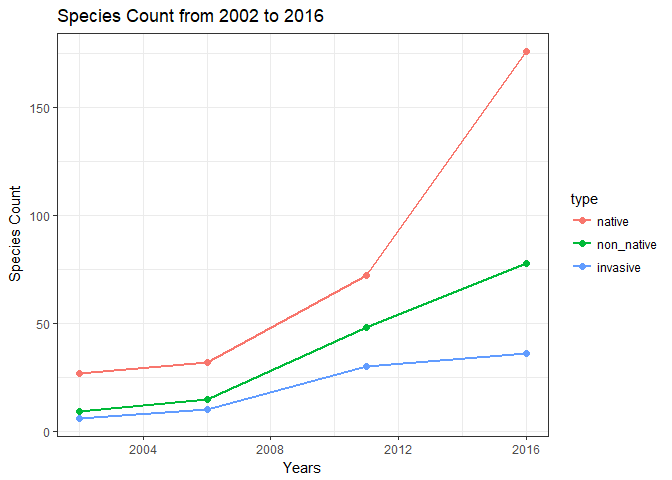
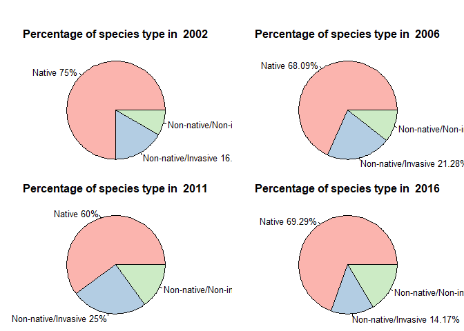
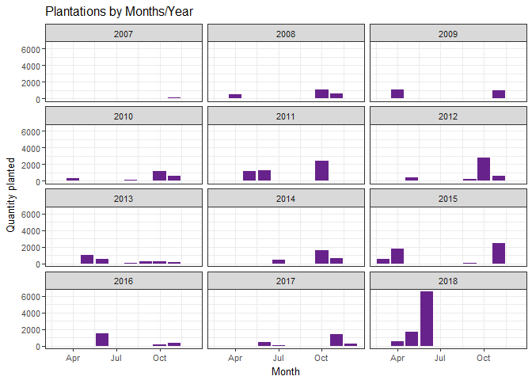

Analysis using R
================

-   [Native, Non-Native and Invasive Species in NYBG](#native-non-native-and-invasive-species-in-nybg)
    -   [Diversity of the forest](#diversity-of-the-forest)
        -   [Species types by survey years](#species-types-by-survey-years)
        -   [Percentage Species Types by Years](#percentage-species-types-by-years)
    -   [Composition of the Forest](#composition-of-the-forest)
        -   [Composition of Woody Plants](#composition-of-woody-plants)
        -   [Composition of Ground Cover](#composition-of-ground-cover)
        -   [Composition of Additional Species](#composition-of-additional-species)
-   [Management Efforts over the year](#management-efforts-over-the-year)
    -   [Invasive Species Control Efforts](#invasive-species-control-efforts)
    -   [Restoration Efforts over the years (2007-2018)](#restoration-efforts-over-the-years-2007-2018)
        -   [Restoration Planting by Years](#restoration-planting-by-years)
        -   [Restoration by Species Types](#restoration-by-species-types)
-   [Additional Findings from Woody cover and Ground cover](#additional-findings-from-woody-cover-and-ground-cover)
    -   [Removing rows that have missing values in all columns except for first year (Year column)](#removing-rows-that-have-missing-values-in-all-columns-except-for-first-year-year-column)
    -   [Massaging the data](#massaging-the-data)
    -   [Including Plots](#including-plots)
-   [Analysis on TFF and NYBG](#analysis-on-tff-and-nybg)
    -   [Contributorship](#contributorship)
    -   [Proofread Statement](#proofread-statement)

Native, Non-Native and Invasive Species in NYBG
===============================================

The source files used for this analysis are already cleaned, the documentation for which can be found in [here](Deliverables/4%20Data%20Cleaning/Data%20Cleaning.md)

**File Used -** Comprehensive Species Tally (1937-2016)

In the first section we will go through the diversity of the forest, where we will concentrate more on the count of species types. In the second section, we will use the inventory of all plants to understand the overall forest composition in terms of coverage on land.

Diversity of the forest
-----------------------

\*\* Reading the source file\*\*

``` r
cst <- read.csv("src/Comprehensive Species Tally 1937-2016.csv", na.strings = "na")
cst <- cst[,-c(2,3,4,6,7,8)]
head(cst)
```

    ##   Survey.Year               Taxon Native Non.native Invasive
    ## 1        2016        acer negundo      y          n        n
    ## 2        2016    acer platanoides      n          y        y
    ## 3        2016 acer pseudoplatanus      n          y        y
    ## 4        2016         acer rubrum      y          n        n
    ## 5        2016    acer saccharinum      y          n        n
    ## 6        2016      acer saccharum      y          n        n

From the above

**Quick summary of the dataset**

``` r
cst$Survey.Year <- factor(cst$Survey.Year)
summary(cst)
```

    ##  Survey.Year                     Taxon     Native  Non.native Invasive
    ##  1937: 18    carpinus caroliniana   :  5   n:189   n:359      n:427   
    ##  2002: 37    fagus grandifolia      :  5   y:322   y:152      y: 84   
    ##  2006: 49    liriodendron tulipifera:  5                              
    ##  2011:131    ostrya virginiana      :  5                              
    ##  2016:276    phellodendron amurense :  5                              
    ##              prunus spp.            :  5                              
    ##              (Other)                :481

**Reshaping the source table**

To analyze the variation of native, non-native and invasive species by years, we need to create a simplified dataframe, that gives us the count by years

``` r
#Create sub-tables
cst_1937 <- subset(cst, cst$Survey.Year==1937)
cst_2002 <- subset(cst, cst$Survey.Year==2002)
cst_2006 <- subset(cst, cst$Survey.Year==2006)
cst_2011 <- subset(cst, cst$Survey.Year==2011)
cst_2016 <- subset(cst, cst$Survey.Year==2016)

# Create vectors for all the years and species -> native, not-native and invasive
#year <- c('1937-01-01', '2002-01-01', '2006-01-01', '2011-01-01', '2016-01-01')
#year <- as.Date(year)
year <- c(1937, 2002, 2006, 2011, 2016)
native <- c(length(which(cst_1937$Native=='y')), length(which(cst_2002$Native=='y')), length(which(cst_2006$Native=='y')), length(which(cst_2011$Native=='y')), length(which(cst_2016$Native=='y')))
non_native <- c(length(which(cst_1937$Non.native=='y')), length(which(cst_2002$Non.native=='y')), length(which(cst_2006$Non.native=='y')), length(which(cst_2011$Non.native=='y')), length(which(cst_2016$Non.native=='y')))
invasive <- c(length(which(cst_1937$Invasive=='y')), length(which(cst_2002$Invasive=='y')), length(which(cst_2006$Invasive=='y')), length(which(cst_2011$Invasive=='y')), length(which(cst_2016$Invasive=='y')))

#Create dataframe with the vectors
cst_trend <- data.frame(year, native, non_native, invasive, stringsAsFactors = FALSE)
head(cst_trend)
```

    ##   year native non_native invasive
    ## 1 1937     15          2        2
    ## 2 2002     27          9        6
    ## 3 2006     32         15       10
    ## 4 2011     72         48       30
    ## 5 2016    176         78       36

### Species types by survey years

To plot the number of species types, We will first reshape the dataframe into the 'long' format and then plot it using ggplot. Reshape2 package has cast and melt functions that can be used to change a dataframe between wide and long format.

``` r
#Reshaping the dataframe
cst_trendL <- melt(cst_trend, id.vars = c("year"))
colnames(cst_trendL)[2] <- "type"
colnames(cst_trendL)[3] <- "count"

#Plotting the dataset
line <- ggplot(cst_trendL, aes(x = year, y = count, color = type)) + geom_line(size=1) + geom_point(size=2)+ ggtitle("Species Types Count from 1937 to 2016") + labs(x="Years", y="Number of different Species")
line <- line + theme_bw()
line
```


The number of species types have increased a lot from the earliest survey data available. The increase in the species types is valid for all the species types.

``` r
cst_trendL [year != 1937,]%>%
  ggplot(aes(x = year, y = count, color = type)) +
  geom_line(size=1) + 
  geom_point(size=2) + 
  ggtitle("Species Count from 2002 to 2016") + labs(x="Years", y="Species Count") + 
  theme_bw()
```



From the period 2002 to 2016, there is a tremendous growth in the total number of species in all the three types - native, non-native and invasive. Although, the number of species has been increasing for all these three types, the growth in invasive species seems to be declining after 2012.

Please note that in the above diagram, the non-native species also includes the invasive species. We may be interested in dividing all the species into - \* Native \* Non-native and Non-invasive \* Invasive (which are also non-native)

### Percentage Species Types by Years

``` r
cst_div <- cst %>%
  mutate(species_type = case_when(Native=='y' ~ 'Native',
                                  (Non.native=='y' & Invasive=='n') ~ 'Non-native/Non-invasive',
                                  (Non.native=='y' & Invasive=='y') ~ 'Non-native/Invasive',
                                  TRUE ~ 'Uncategorized'))
```

    ## Warning: package 'bindrcpp' was built under R version 3.4.4

``` r
cst_div <- cst_div[,-c(3,4,5)]
cst_div <- subset(cst_div, species_type!='Uncategorized')
cst_div$species_type <- factor(cst_div$species_type)

#Creating new dataframe with species type count
species_type_count <- cst_div %>%
  count(Survey.Year, species_type)
species_type_count
```

    ## # A tibble: 14 x 3
    ##    Survey.Year species_type                n
    ##    <fct>       <fct>                   <int>
    ##  1 1937        Native                     15
    ##  2 1937        Non-native/Invasive         2
    ##  3 2002        Native                     27
    ##  4 2002        Non-native/Invasive         6
    ##  5 2002        Non-native/Non-invasive     3
    ##  6 2006        Native                     32
    ##  7 2006        Non-native/Invasive        10
    ##  8 2006        Non-native/Non-invasive     5
    ##  9 2011        Native                     72
    ## 10 2011        Non-native/Invasive        30
    ## 11 2011        Non-native/Non-invasive    18
    ## 12 2016        Native                    176
    ## 13 2016        Non-native/Invasive        36
    ## 14 2016        Non-native/Non-invasive    42

``` r
par(mar=c(0, 0, 2, 0), oma=c(0,0,2,0), mfrow=c(2,2))
#Creating the pie for the year 2002
for(i in levels(species_type_count$Survey.Year)){
  if(i=='1937'){
    next
  }
  count_i <- species_type_count[species_type_count$Survey.Year == i,-c(1)]
  slices <- count_i$n
  
  labels <-  count_i$species_type
  percent <- round(slices/sum(slices)*100, digits = 2)
  labels <- paste(labels, percent)
  labels <- paste(labels, "%", sep="")
  
  pie(slices, labels, main=paste("Percentage of species type in ", i), col=brewer.pal(length(labels),"Pastel1"))
}
```



If we analyze the charts above, we can see that the percentage of species found in NYBG has decreased for the survey years 2006(75% to 68%) and 2011(68% to 60%) from where it increased to 69% in the 2016 survey. Similar trends are also found in invasive species which increased from 16.6% in 2002 to 35% in 2011. The number of invasive species found in NYBG seems to have decrased by more than 10% in the survey year 2016. This is a good sign and reflects the success of the management efforts in invasive species control.

Composition of the Forest
-------------------------

Till now, we have discussed about the diversity of the forest, emphasizing on the count of species and its trends over the years. NYBG also has an inventory of all the plants and its coverage divided into - Woody Plants, Ground Cover and Additional Species.

The types of plants that we will be analyzing in the further sections are -

-   Woody Plants
-   Ground Cover
-   Additional Species

### Composition of Woody Plants

From the survey data of Woody Plants, we can analyze the year wise composition of forest by native/non-native and invasive.

``` r
woody_plants = read.csv("src/inventory/woodyplant 1937-2016.csv", na.strings = "#N/A")
woody_plants <- na.omit(woody_plants)
woody_plants <- woody_plants[,-c(2,3)]
```

``` r
woody_plants_1937 <- subset(woody_plants, woody_plants$Year==1937)
woody_plants_2002 <- subset(woody_plants, woody_plants$Year==2002)
woody_plants_2006 <- subset(woody_plants, woody_plants$Year==2006)
woody_plants_2011 <- subset(woody_plants, woody_plants$Year==2011)
woody_plants_2016 <- subset(woody_plants, woody_plants$Year==2016)

# Create vectors for all the years and species -> native, not-native and invasive
#year <- c('1937-01-01', '2002-01-01', '2006-01-01', '2011-01-01', '2016-01-01')
#year <- as.Date(year)
year <- c(1937, 2002, 2006, 2011, 2016)
native <- c(length(which(woody_plants_1937$Native=='y')), length(which(woody_plants_2002$Native=='y')), length(which(woody_plants_2006$Native=='y')), length(which(woody_plants_2011$Native=='y')), length(which(woody_plants_2016$Native=='y')))
non_native <- c(length(which(woody_plants_1937$Non.native=='y')), length(which(woody_plants_2002$Non.native=='y')), length(which(woody_plants_2006$Non.native=='y')), length(which(woody_plants_2011$Non.native=='y')), length(which(woody_plants_2016$Non.native=='y')))
invasive <- c(length(which(woody_plants_1937$Invasive=='y')), length(which(woody_plants_2002$Invasive=='y')), length(which(woody_plants_2006$Invasive=='y')), length(which(woody_plants_2011$Invasive=='y')), length(which(woody_plants_2016$Invasive=='y')))

#Create dataframe with the vectors
woody_plants_trend <- data.frame(year, native, non_native, invasive, stringsAsFactors = FALSE)
head(woody_plants_trend)
```

    ##   year native non_native invasive
    ## 1 1937    455          5        5
    ## 2 2002    918        103       95
    ## 3 2006   2610        816      784
    ## 4 2011   3789        932      910
    ## 5 2016   4970       1097     1028

``` r
woody_plants_trendL <- melt(woody_plants_trend, id.vars = c("year"))
colnames(woody_plants_trendL)[2] <- "type"
colnames(woody_plants_trendL)[3] <- "count"

woody_plants_trendL[year != 1937,] %>%
  ggplot(aes(x = year, y = count, color = type)) + 
  geom_line(size=1) + geom_point(size=2) + 
  ggtitle("Woody Plants Count from 2002 to 2016") + labs(x="Years", y="Count") +
  theme_bw()
```


### Composition of Ground Cover

From the survey data of Groundcover Plants, we can analyze the year wise composition of forest by native/non-native and invasive. The groundcover data is only available for 2 years (2011 and 2016). The analysis for groundcover is little different from Woody Plants. This is because the data is captured in terms of spread (in cm). We will separately calculate the ground cover for each of these species for the years and then join them to have one complete dataset

``` r
gc_plants = read.csv("src/inventory/groundcover 2011-2016.csv", na.strings = "#N/A")
gc_plants <- na.omit(gc_plants)
gc_plants <- gc_plants[,-c(2,3)]

summary(gc_plants)
```

    ##       Year                              Taxon      Sum.of.Cover..cm.
    ##  Min.   :2011   eurybia divaricata         : 740   Min.   :  0.00   
    ##  1st Qu.:2011   parthenocissus quinquefolia: 614   1st Qu.: 10.00   
    ##  Median :2016   toxicodendron radicans     : 401   Median : 26.00   
    ##  Mean   :2014   aralia elata               : 346   Mean   : 54.23   
    ##  3rd Qu.:2016   prunus serotina            : 343   3rd Qu.: 67.00   
    ##  Max.   :2016   lindera benzoin            : 284   Max.   :500.00   
    ##                 (Other)                    :3434                    
    ##  Native   Non.native Invasive
    ##  n:1296   n:4977     n:5017  
    ##  y:4866   y:1185     y:1145  
    ##                              
    ##                              
    ##                              
    ##                              
    ## 

To avoid the complication, we would divide the above data separately into Native, Non-native and Invasice species so as to analyze the trends individually.

``` r
gc_native_summary <- gc_plants[gc_plants$Native == 'y',] %>%
  group_by(Year) %>%
  summarise(native = sum(Sum.of.Cover..cm.)) %>%
  arrange(desc(native))

gc_non_native_summary <- gc_plants[gc_plants$Non.native == 'y',] %>%
  group_by(Year) %>%
  summarise(non_native = sum(Sum.of.Cover..cm.)) %>%
  arrange(desc(non_native))

gc_invasive_summary <- gc_plants[gc_plants$Invasive == 'y',] %>%
  group_by(Year) %>%
  summarise(invasive = sum(Sum.of.Cover..cm.)) %>%
  arrange(desc(invasive))

#Left joining the above three
gc_summary <- gc_native_summary %>%
  left_join(gc_non_native_summary) %>%
  left_join(gc_invasive_summary)
```

    ## Joining, by = "Year"
    ## Joining, by = "Year"

``` r
#Reshaping the dataframe for a more plot friendly form
gc_summary <- melt(gc_summary, id.vars = c("Year"))
colnames(gc_summary)[2] <- "species_type"
colnames(gc_summary)[3] <- "ground_cover"

gc_summary$ground_cover <- gc_summary$ground_cover/100

#Plotting the above using line chart
gc_summary %>%
  ggplot(aes(x=Year, y=ground_cover, color=species_type)) +
  geom_line(size=1) +
  geom_point(size=2) +
  labs(y= "Ground Cover in meters", title = "Ground Cover by Species Type")
```


As we can see above, from the year 2011 to 2016, the ground cover has increased for native, where as it has decreased for non-native and invasive species.

### Composition of Additional Species

In the last section, we will see the growth trends of the Additional Species.

``` r
as_plants <- read.csv("src/inventory/additionalspecies 2011-2016.csv", na.strings = "#N/A")
as_plants <- na.omit(as_plants)
as_plants <- as_plants[,-c(2,3)]

summary(as_plants)
```

    ##       Year                          Taxon      Native   Non.native
    ##  Min.   :2011   maianthemum racemosum  : 162   n: 965   n:1934    
    ##  1st Qu.:2011   toxicodendron radicans :  94   y:1831   y: 862    
    ##  Median :2016   phytolacca americana   :  92                      
    ##  Mean   :2014   aralia elata           :  84                      
    ##  3rd Qu.:2016   quercus rubra          :  76                      
    ##  Max.   :2016   liquidambar styraciflua:  68                      
    ##                 (Other)                :2220                      
    ##  Invasive
    ##  n:2128  
    ##  y: 668  
    ##          
    ##          
    ##          
    ##          
    ## 

``` r
as_native_summary <- as_plants[as_plants$Native == 'y',] %>%
  count(Year)
colnames(as_native_summary)[2] <- "native"

as_non_native_summary <- as_plants[as_plants$Non.native == 'y',] %>%
  count(Year)
colnames(as_non_native_summary)[2] <- "non_native"

as_invasive_summary <- as_plants[as_plants$Invasive == 'y',] %>%
  count(Year)
colnames(as_invasive_summary)[2] <- "invasive"

as_summary <- as_native_summary %>%
  left_join(as_non_native_summary) %>%
  left_join(as_invasive_summary)
```

    ## Joining, by = "Year"
    ## Joining, by = "Year"

``` r
# Reshaping the dataframe
as_summary <- melt(as_summary, id.vars = c("Year"))
colnames(as_summary)[2] <- "species_type"
colnames(as_summary)[3] <- "count"

as_summary %>%
  ggplot(aes(x=Year, y=count, color=species_type)) +
  geom_line(size=1) +
  geom_point(size=2) +
  labs(y= "Ground Cover in meters", title = "Count by Species Type")
```


From 2011 to 2016. the overall numbder of species has increased for all the three species types. The rate of increase in invasive species is lower than the other two, which is evident by the smaller slope.

Management Efforts over the year
================================

Invasive Species Control Efforts
--------------------------------

NYBG untakes several intitatives to manage the forest. One of them is Invasive Species Control, which can direcly impact the growth trends of Invasive Species over the years

``` r
work_hours <- read.csv("src/forest mgmt hours.csv")
work_hours <- work_hours[,c(2,4,5)]

#Reshaping
work_hours2 <- melt(work_hours, id.vars = c("year"))
colnames(work_hours2)[2] <- "employee_type"
colnames(work_hours2)[3] <- "hours"

# Summarising Invasive Plant Management
work_hours_summary <- work_hours2 %>%
  group_by(year, employee_type) %>%
  summarise(hours = sum(hours))

work_hours_summary %>%
  ggplot(aes(x=year, y=hours, fill = employee_type)) +
  geom_bar(stat = "identity")
```


The hours invested in the Invasive Species Control do not directly correlate with the Species Count. There can be a variety of reasons for this, one of them being that these efforts take time to reflect in the composition of the forests, as the growth of trees take years. However, the overall condition of the forest has improved after the management efforts, so certainly these efforts have an effect.

Restoration Efforts over the years (2007-2018)
----------------------------------------------

Towards the management goals, there are active restoration projects that have been going on since 2007.

By analysing the source file 'NYBG Forest Restoration Planting we can analyze the restoration efforts during the survey period.

``` r
restoration <- read.csv("src/NYBG Forest Restoration Plantings 2007-2018.csv", stringsAsFactors = FALSE)
restoration <- restoration[,-c(1,5,6,7,9)]

attach(restoration)

# Modifying the Data Types
restoration$Date.Planted <- as.Date(Date.Planted, "%m/%d/%Y")
restoration$Plant.Type <- as.factor(Plant.Type)

head(restoration)
```

    ##   Qty                Taxon Plant.Type Date.Planted
    ## 1   4      quercus bicolor       Tree   2007-05-01
    ## 2   5 hamamelis virginiana      Shrub   2007-11-11
    ## 3   4 hamamelis virginiana      Shrub   2007-11-11
    ## 4  12    viburnum dentatum      Shrub   2007-11-11
    ## 5  12    viburnum dentatum      Shrub   2007-11-11
    ## 6  12 viburnum prunifolium      Shrub   2007-11-11

A quick summary of the dataframe provides us with important information about the data under analysis

``` r
summary(restoration)
```

    ##       Qty             Taxon           Plant.Type   Date.Planted       
    ##  Min.   :   1.00   Length:1153        Herb :541   Min.   :2007-05-01  
    ##  1st Qu.:   7.00   Class :character   Shrub:176   1st Qu.:2011-06-08  
    ##  Median :  17.00   Mode  :character   Tree :436   Median :2012-10-26  
    ##  Mean   :  33.18                                  Mean   :2013-10-07  
    ##  3rd Qu.:  40.00                                  3rd Qu.:2016-06-16  
    ##  Max.   :1000.00                                  Max.   :2018-06-22

This provides us with some imporant information on the data. There are 3 plant types, that have been planted as a part of restoration processes - \* Herb \* Shrubs \* Tree

``` r
#Total plants planted
sum(Qty)
```

    ## [1] 38258

``` r
#Total plants planted by Type
res_qty_type <- restoration %>%
  group_by(Plant.Type) %>%
  summarise(Qty = sum(Qty))
res_qty_type
```

    ## # A tibble: 3 x 2
    ##   Plant.Type   Qty
    ##   <fct>      <int>
    ## 1 Herb       21974
    ## 2 Shrub       2701
    ## 3 Tree       13583

``` r
# Pie Chart for the plants planted by Type
slices <- res_qty_type$Qty
labels <-  res_qty_type$Plant.Type
percent <- round(slices/sum(slices)*100, digits = 2)
labels <- paste(labels, percent)
labels <- paste(labels, "%", sep="")

pie(slices, labels, main="Plant types planted", col=brewer.pal(length(labels),"Pastel1"))
```


57.44% of the restoration plantings were for Herbs followed by the Trees (35.5%). There have been plantation of Shrubs as well, even though the percentage is pretty less compared to the other two (7.06%)

### Restoration Planting by Years

If we summarise the planting by year, we can identify if the restoration efforts are consistent throughtout the period of study.

``` r
#Adding a column for the year
restoration <- restoration %>%
  mutate(year_planted = year(restoration$Date.Planted))

#Adding a column for the month
restoration <- restoration %>%
  mutate(month_planted = month(restoration$Date.Planted))

#Summarising number of plants planted by years
res_qty_year <- restoration %>%
  group_by(year_planted) %>%
  summarise(Qty = sum(Qty))

plot_qty_year <- ggplot(res_qty_year, aes(x=res_qty_year$year_planted, y=res_qty_year$Qty)) + geom_bar(stat = "identity", fill = "#2987bb") + 
  geom_text(y=res_qty_year$Qty+300 , label = res_qty_year$Qty) + 
  ggtitle("Restoration Planting by Years") + labs(x="Years", y="Plants planted") +
  theme_bw()
plot_qty_year
```


From the plot, it is evident that the plantations are not consistent. Even with the possibility of incomplete data, we cannot ignore the fact that 2018 has been a very active year for forest restoration.

``` r
boxplot(res_qty_year$Qty, main = "Plants planted by years", xlab="Quantity", col = "#ec8a71")
```


``` r
quantile(res_qty_year$Qty)
```

    ##      0%     25%     50%     75%    100% 
    ##  101.00 2125.25 2277.00 4284.50 8678.00

The above figure confirms the scattered nature of the plantations, while the average plats planted is 2277, it has gone as low as 101 and as high as 8678.

``` r
#Plantation by month and year
res_month <- restoration %>%
  group_by(year_planted, month_planted) %>%
  summarise(Qty = sum(Qty))

#Adding a dummy month column for X Label
res_month <- res_month %>%
  mutate(month2_planted = as.Date(paste0("2000-", month_planted, "-01"), "%Y-%m-%d"))

#Plotting the new dataset
res_month %>%
  ggplot(aes(x=month2_planted, y=Qty)) +
    geom_bar(stat = "identity", fill = "darkorchid4") +
  facet_wrap(~year_planted, ncol = 3) +
    labs(title="Plantations by Months/Year", x="Month", y="Quantity planted")+
  theme_bw(base_size = 10) + scale_x_date(date_labels = "%b")
```



Further, looking at the whole data monthly for all the years, the inconsistency in the plantation is more clear. There is no specific pattern in the plantations that has taken place except the fact that for all the years, there has been no restoration planting during the months December and January, during which the weather is extremely cold.

### Restoration by Species Types

Using the comprehensive species tally we can classify the restoration platings by species type. To do this, we will left join the Restoration Data with Comprehensive Species Tally. There are some of the species planted for which we did not have enough information to categorize them as Native/Non-Native and Invasive. We would be skipping these in the below analysis.

``` r
# Removing duplicates from Comprehensive Speices Tally
cst_dedup <- cst[!duplicated(cst$Taxon),]

# Left Joining Restoration Data with Comprehensive Species Tally
res_by_species <- restoration %>%
  left_join(cst_dedup)
```

    ## Joining, by = "Taxon"

    ## Warning: Column `Taxon` joining character vector and factor, coercing into
    ## character vector

``` r
res_by_species <- na.omit(res_by_species)

summary(res_by_species)
```

    ##       Qty            Taxon           Plant.Type   Date.Planted       
    ##  Min.   :  1.00   Length:759         Herb :242   Min.   :2007-05-01  
    ##  1st Qu.:  7.00   Class :character   Shrub:132   1st Qu.:2010-11-09  
    ##  Median : 17.00   Mode  :character   Tree :385   Median :2012-10-24  
    ##  Mean   : 32.09                                  Mean   :2013-06-01  
    ##  3rd Qu.: 40.50                                  3rd Qu.:2015-11-18  
    ##  Max.   :500.00                                  Max.   :2018-06-22  
    ##   year_planted  month_planted    Survey.Year Native  Non.native Invasive
    ##  Min.   :2007   Min.   : 3.000   1937:  1    n:  0   n:759      n:759   
    ##  1st Qu.:2010   1st Qu.: 6.000   2002:  0    y:759   y:  0      y:  0   
    ##  Median :2012   Median :10.000   2006:  0                               
    ##  Mean   :2013   Mean   : 8.426   2011:  6                               
    ##  3rd Qu.:2015   3rd Qu.:11.000   2016:752                               
    ##  Max.   :2018   Max.   :12.000

The quick summary tells us that in the data set that we are dealing with, all the restoraiton planting has been for native species. To understand the correlation between the restoration and the number of species types, let us simplify the above dataframe.

``` r
res_native <- res_by_species[, c(1, 5)]

# Summarizing by year
res_native_by_year <- res_native %>%
  group_by(year_planted) %>%
  summarise(qty_planted = sum(Qty))

#Plotting
res_native_by_year[res_native_by_year$year_planted<2017,] %>%
  ggplot(aes(x=year_planted, y=qty_planted)) +
  geom_bar(stat = "identity", fill = "darkorchid4")
```


Additional Findings from Woody cover and Ground cover
=====================================================

``` r
woodyplants <- read_xlsx("src/Combined Woody Plants Data (2002,2006,2011,2016).xlsx")
groundcover <- read.csv("src/Combined Groundcover2011_2016.csv", stringsAsFactors = FALSE)

head(woodyplants)
```

    ## # A tibble: 6 x 8
    ##    Year `Transect Number` `Plot Number` `N/S` Genus    `Specific epithet`
    ##   <dbl>             <dbl>         <dbl> <chr> <chr>    <chr>             
    ## 1  1937              3.00          4.00 N     Fraxinus sp.               
    ## 2  1937             11.0           4.00 N     Tsuga    canadensis        
    ## 3  1937             13.0           1.00 N     Cornus   sp.               
    ## 4  1937             17.0          14.0  S     Cornus   sp.               
    ## 5  1937             19.0           3.00 S     Cornus   sp.               
    ## 6  1937              3.00          2.00 S     Cornus   sp.               
    ## # ... with 2 more variables: `DBH (cm)` <dbl>, BA <dbl>

``` r
tail(woodyplants)
```

    ## # A tibble: 6 x 8
    ##    Year `Transect Number` `Plot Number` `N/S` Genus    `Specific epithet`
    ##   <dbl>             <dbl>         <dbl> <chr> <chr>    <chr>             
    ## 1  2016              27.0          6.00 S     Fraxinus americana         
    ## 2  2016              27.0          6.00 N     Dead     <NA>              
    ## 3  2016              27.0          6.00 N     Dead     <NA>              
    ## 4  2016              27.0          6.00 N     Fraxinus americana         
    ## 5  2016              27.0          6.00 N     Fraxinus americana         
    ## 6  2016              27.0          6.00 N     Fraxinus americana         
    ## # ... with 2 more variables: `DBH (cm)` <dbl>, BA <dbl>

``` r
str(woodyplants)
```

    ## Classes 'tbl_df', 'tbl' and 'data.frame':    19595 obs. of  8 variables:
    ##  $ Year            : num  1937 1937 1937 1937 1937 ...
    ##  $ Transect Number : num  3 11 13 17 19 3 3 5 5 5 ...
    ##  $ Plot Number     : num  4 4 1 14 3 2 2 13 16 7 ...
    ##  $ N/S             : chr  "N" "N" "N" "S" ...
    ##  $ Genus           : chr  "Fraxinus" "Tsuga" "Cornus" "Cornus" ...
    ##  $ Specific epithet: chr  "sp." "canadensis" "sp." "sp." ...
    ##  $ DBH (cm)        : num  2.54 2.54 2.54 2.54 2.54 5.08 5.08 5.08 5.08 5.08 ...
    ##  $ BA              : num  0.000507 0.000507 0.000507 0.000507 0.000507 ...

``` r
summary(woodyplants)
```

    ##       Year      Transect Number  Plot Number        N/S           
    ##  Min.   :1937   Min.   : 1.00   Min.   :  1.0   Length:19595      
    ##  1st Qu.:2006   1st Qu.: 9.00   1st Qu.:  7.0   Class :character  
    ##  Median :2011   Median :13.00   Median : 14.0   Mode  :character  
    ##  Mean   :2009   Mean   :13.19   Mean   : 39.8                     
    ##  3rd Qu.:2016   3rd Qu.:17.00   3rd Qu.: 32.0                     
    ##  Max.   :2016   Max.   :27.00   Max.   :247.0                     
    ##                 NA's   :89      NA's   :89                        
    ##     Genus           Specific epithet      DBH (cm)             BA         
    ##  Length:19595       Length:19595       Min.   :  1.000   Min.   :0.00000  
    ##  Class :character   Class :character   1st Qu.:  1.427   1st Qu.:0.00016  
    ##  Mode  :character   Mode  :character   Median :  2.400   Median :0.00045  
    ##                                        Mean   :  7.780   Mean   :0.01946  
    ##                                        3rd Qu.:  6.400   3rd Qu.:0.00322  
    ##                                        Max.   :140.600   Max.   :1.55260  
    ##                                        NA's   :91        NA's   :90

``` r
head(groundcover)
```

    ##   Sample.Date Transect.Number Plot.Number Plot.Corner               Genus
    ## 1   6/20/2011               1           1          NE Coarse Woody Debris
    ## 2   6/20/2011               1           1          NW Coarse Woody Debris
    ## 3   6/20/2011               1           1          SE Coarse Woody Debris
    ## 4   6/20/2011               1           1          SW Coarse Woody Debris
    ## 5   6/20/2011               1           2          NE Coarse Woody Debris
    ## 6   6/20/2011               1           2          NW Coarse Woody Debris
    ##   Specific.epithet X0.1 X1.2 X2.3 X3.4 X4.5
    ## 1                     0    8    0    0   10
    ## 2                   100  100  100   70   40
    ## 3                    50    5    0   20    0
    ## 4                     0    0    0    8    0
    ## 5                     0    0   10    0    0
    ## 6                     0    0    0    8    0

``` r
tail(groundcover)
```

    ##       Sample.Date Transect.Number Plot.Number Plot.Corner       Genus
    ## 12355   7/28/2011              15          27          NW    Viburnum
    ## 12356   7/28/2011              15          27          SE       Fagus
    ## 12357   7/28/2011              15          27          SE Maianthemum
    ## 12358   7/28/2011              15          27          SW      Aralia
    ## 12359   7/28/2011              15          27          SW Maianthemum
    ## 12360   7/28/2011              15          27          SW     Quercus
    ##       Specific.epithet X0.1 X1.2 X2.3 X3.4 X4.5
    ## 12355         dentatum    0    0    0 10.0    0
    ## 12356      grandifolia    0    1    0  0.0   24
    ## 12357        canadense    0    0   10  0.0    2
    ## 12358            elata    7   41   13  0.0    0
    ## 12359        canadense    0    0    0  1.0    0
    ## 12360            rubra    0    0    0  0.0    2

``` r
str(groundcover)
```

    ## 'data.frame':    12360 obs. of  11 variables:
    ##  $ Sample.Date     : chr  "6/20/2011" "6/20/2011" "6/20/2011" "6/20/2011" ...
    ##  $ Transect.Number : num  1 1 1 1 1 1 1 1 1 1 ...
    ##  $ Plot.Number     : num  1 1 1 1 2 2 2 2 3 3 ...
    ##  $ Plot.Corner     : chr  "NE" "NW" "SE" "SW" ...
    ##  $ Genus           : chr  "Coarse Woody Debris" "Coarse Woody Debris" "Coarse Woody Debris" "Coarse Woody Debris" ...
    ##  $ Specific.epithet: chr  "" "" "" "" ...
    ##  $ X0.1            : num  0 100 50 0 0 0 0 8 0 0 ...
    ##  $ X1.2            : num  8 100 5 0 0 0 0 0 8 0 ...
    ##  $ X2.3            : num  0 100 0 0 10 0 0 20 0 5 ...
    ##  $ X3.4            : chr  "0" "70" "20" "8" ...
    ##  $ X4.5            : num  10 40 0 0 0 0 0 0 0 0 ...

``` r
summary(groundcover)
```

    ##  Sample.Date        Transect.Number  Plot.Number    Plot.Corner       
    ##  Length:12360       Min.   : 1.00   Min.   : 1.00   Length:12360      
    ##  Class :character   1st Qu.: 9.00   1st Qu.: 4.00   Class :character  
    ##  Mode  :character   Median :13.00   Median : 9.00   Mode  :character  
    ##                     Mean   :13.17   Mean   :10.46                     
    ##                     3rd Qu.:17.00   3rd Qu.:15.00                     
    ##                     Max.   :27.00   Max.   :30.00                     
    ##                                                                       
    ##     Genus           Specific.epithet        X0.1            X1.2        
    ##  Length:12360       Length:12360       Min.   :  0.0   Min.   :   0.00  
    ##  Class :character   Class :character   1st Qu.:  0.0   1st Qu.:   0.00  
    ##  Mode  :character   Mode  :character   Median :  1.0   Median :   2.00  
    ##                                        Mean   : 22.2   Mean   :  22.78  
    ##                                        3rd Qu.: 30.0   3rd Qu.:  30.00  
    ##                                        Max.   :555.0   Max.   :1000.00  
    ##                                        NA's   :2       NA's   :2        
    ##       X2.3            X3.4                X4.5       
    ##  Min.   :  0.00   Length:12360       Min.   :  0.00  
    ##  1st Qu.:  0.00   Class :character   1st Qu.:  0.00  
    ##  Median :  2.00   Mode  :character   Median :  2.00  
    ##  Mean   : 22.68                      Mean   : 22.39  
    ##  3rd Qu.: 30.00                      3rd Qu.: 30.00  
    ##  Max.   :400.00                      Max.   :640.00  
    ##  NA's   :4                           NA's   :9

``` r
##forestmgmt <- read_xls("NYBG Forest Management_11052008 to 12312014.xls")
```

### Removing rows that have missing values in all columns except for first year (Year column)

``` r
## First We are checking if there are any missing year column which is the first column on the datasets
sum(is.na(woodyplants$Year))
```

    ## [1] 0

``` r
sum(is.na(groundcover$Sample.Date))
```

    ## [1] 0

``` r
## Removing the empty rows
woodyplants <- woodyplants[rowSums(is.na(woodyplants)) < 7,]
groundcover <- groundcover[rowSums(is.na(groundcover)) < 10,]
```

### Massaging the data

``` r
woodyplants$`Transect Number` <- as.factor(woodyplants$`Transect Number`)
woodyplants$`Plot Number` <- as.factor(woodyplants$`Plot Number`)

groundcover$Transect.Number <- as.factor(groundcover$Transect.Number)
groundcover$Plot.Number <- as.factor(groundcover$Plot.Number)
groundcover$Sample.Date <- as.Date(groundcover$Sample.Date, format = "%m/%d/%Y")

#Set all the values in Genus to uppercases
woodyplants$Genus <- toupper(woodyplants$Genus)

library(dplyr)

#Get top 7 Genus
top_7 <- woodyplants %>% count(Genus) %>% arrange(desc(n)) %>% filter(n > 1000)

#Create a vector with top 7 Genus
target <- c("PRUNUS","DEAD","LINDERA","ACER","ARALIA","FAGUS","VIBURNUM")

#Get top 7 Genus with Year
top_7_year <- woodyplants %>% count(Year,Genus) %>% arrange(desc(n)) %>% filter(Genus %in% target )

#Create plots
```

### Including Plots

``` r
library(ggplot2)

ggplot(top_7_year, aes(x = Genus, y = n, fill = factor(Year)), position ="dodge") + geom_bar(stat = "identity")
```


``` r
ggplot(top_7_year, aes(x = Genus, y = n, fill = factor(Year)), position ="dodge") + geom_bar(stat = "identity", position = "dodge")
```


Analysis on TFF and NYBG
========================

-   [Analysis on TFF Management](Analysis_and_plots_files/tableau_exports/TFF%20Management%20Analysis.pdf)
-   [Analysis on Forest Restoration](Analysis_and_plots_files/tableau_exports/NYBG%20Forest%20Restoration%202007%20Analysis%20-%202018.pdf)

Contributorship
---------------

Kumar Vikash

-   Native, non-native and invasive species in NYBG
-   Diversity of the forest
-   Composition of the forest
-   Management Efforts over the years
-   Invasive Species Control Efforts
-   Restoration Efforts

Edem Dosseh

-   Additional Findings from Woody Cover and Ground cover

Harwinder Kaur

-   Analysis on TFF and NYBG

Proofread Statement
-------------------

The document was proofread by Kumar Vikash on Dec 7, 2018
