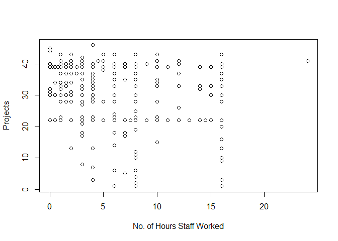

Harwinder r-script
================

Understanding TFF Management Record
-----------------------------------

The TFF Management Record, records the data from 01/02/2015 to 06/20/2016 (dd/mm/yyyy).The New York Botanical Garden organizes various projects that focus on maintaining the health of the Thain Family Forest. The document serves as a repository to input the details about the projects that were organized as well as record the information regarding number of volunteers who participated in various projects.It records the date, month and year on which the project was carried out and what tasks were carried out in the project.

Including Code
--------------

You can include R code in the document as follows:

``` r
tff <- read.csv("Tff Management Record.csv")
head(tff)
```

    ##   ï..Project.Date Number.of.Staff.Hours.Worked
    ## 1        1/2/2015                            8
    ## 2        1/5/2015                           12
    ## 3        1/5/2015                            3
    ## 4        1/6/2015                            4
    ## 5        1/6/2015                            4
    ## 6        1/6/2015                            7
    ##   Number.of.Volunteer.Student.Intern.Hours.Worked
    ## 1                                               6
    ## 2                                               0
    ## 3                                               0
    ## 4                                               0
    ## 5                                               0
    ## 6                                               0
    ##                  Project.Type Species.Managed Type.of.Research Trail.Name
    ## 1 Invasive Species Management    Hedera helix                            
    ## 2 Invasive Species Management    Hedera helix                            
    ## 3                     Mapping                                            
    ## 4    Cleaned out Stone Garage                                            
    ## 5 Invasive Species Management    Hedera helix                            
    ## 6                Snow Removal                                            
    ##   Tasks X
    ## 1        
    ## 2        
    ## 3        
    ## 4        
    ## 5        
    ## 6

Summary

``` r
summary(tff)
```

    ##   ï..Project.Date Number.of.Staff.Hours.Worked
    ##  1/6/2015 :  6    Min.   : 0.000              
    ##  5/20/2016:  5    1st Qu.: 3.000              
    ##  1/12/2015:  4    Median : 6.000              
    ##  1/26/2015:  4    Mean   : 7.231              
    ##  1/30/2015:  4    3rd Qu.:12.000              
    ##  1/5/2015 :  4    Max.   :24.000              
    ##  (Other)  :643                                
    ##  Number.of.Volunteer.Student.Intern.Hours.Worked
    ##  Min.   :  0.000                                
    ##  1st Qu.:  0.000                                
    ##  Median :  1.000                                
    ##  Mean   :  5.975                                
    ##  3rd Qu.:  6.000                                
    ##  Max.   :111.000                                
    ##                                                 
    ##                                       Project.Type
    ##  Invasive Species Management                :254  
    ##  Trail Maintenance/Repair (including fences): 80  
    ##  Research & Monitoring                      : 56  
    ##  Restoration Planting                       : 35  
    ##  Trash Clean Up                             : 29  
    ##  Mapping                                    : 28  
    ##  (Other)                                    :188  
    ##                                      Species.Managed
    ##                                              :416   
    ##  Viburnum Leaf Beetle                        : 45   
    ##  Ficaria verna                               : 32   
    ##  Reynoutria japonica or Reynoutria x bohemica: 29   
    ##  Aralia elata                                : 15   
    ##  Hedera helix                                : 11   
    ##  (Other)                                     :122   
    ##                         Type.of.Research
    ##                                 :597    
    ##  Water Quality                  : 34    
    ##  Camera Traps                   :  7    
    ##  Salamanders                    :  5    
    ##  Viburnum Leaf Beetle           :  3    
    ##  Corydalis incisa transect study:  2    
    ##  (Other)                        : 22    
    ##                                  Trail.Name 
    ##                                       :619  
    ##  Spicebush Trail                      : 12  
    ##  Bridge Trail                         :  8  
    ##  Waterfall Trail                      :  8  
    ##  Bridge Trail, Ridge Trail            :  3  
    ##  Cherry Valley Stairs, Waterfall Trail:  3  
    ##  (Other)                              : 17  
    ##                          Tasks    
    ##                             :617  
    ##  Fence Repair               : 24  
    ##  Cleaning Water Bars, Raking:  6  
    ##  Raking, Weeding            :  4  
    ##  Weeding, Raking            :  4  
    ##  Raking                     :  3  
    ##  (Other)                    : 12  
    ##                                        X      
    ##                                         :656  
    ##  Cleaning seeds                         :  3  
    ##  Cleaning seeds, Sterilizing/Mixing soil:  1  
    ##  Maintenance                            :  6  
    ##  Sowing/Replanting                      :  3  
    ##  Sowing/Replanting, Cleaning seeds      :  1  
    ## 

Plot

``` r
plot(tff$Number.of.Staff.Hours.Worked, tff$Project.Type, xlab = "No. of Hours Staff Worked", ylab = "Projects")
```



Including Plots
---------------

You can also embed plots, for example:

Note that the `echo = FALSE` parameter was added to the code chunk to prevent printing of the R code that generated the plot.
