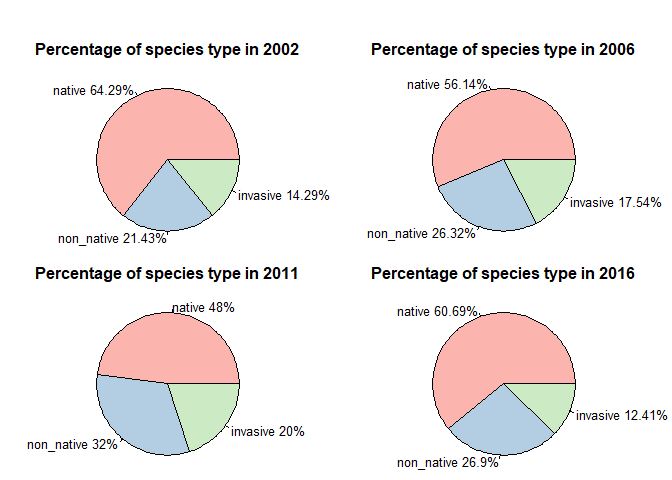

R-Script
================

New York Botanical Garden Analysis
==================================

1. Trend in native, non-native and invasive species over the years
------------------------------------------------------------------

The source files used for this analysis are already cleaned, the documentation for which can be found in [here](Deliverables/4%20Data%20Cleaning/Data%20Cleaning.md)

File Used - Comprehensive Species Tally (1937-2016)

\*\* Reading the file\*\*

``` r
cst <- read.csv("src/Comprehensive Species Tally 1937-2016.csv", na.strings = "na")
cst <- cst[,-c(2,3,4)]
head(cst)
```

    ##   Survey.Year               Taxon Appear.in.Woody.Survey
    ## 1        2016        Acer negundo                      n
    ## 2        2016    Acer platanoides                      y
    ## 3        2016 Acer pseudoplatanus                      y
    ## 4        2016         Acer rubrum                      y
    ## 5        2016    Acer saccharinum                      n
    ## 6        2016      Acer saccharum                      y
    ##   Appear.in.Herb.Transects Appear.as.Additional.Species Native Non.native
    ## 1                        n                            y      y          n
    ## 2                        y                            y      n          y
    ## 3                        y                            y      n          y
    ## 4                        y                            y      y          n
    ## 5                        y                            n      y          n
    ## 6                        y                            y      y          n
    ##   Invasive
    ## 1        n
    ## 2        y
    ## 3        y
    ## 4        n
    ## 5        n
    ## 6        n

**Quick summary of the dataset**

``` r
cst$Survey.Year <- factor(cst$Survey.Year)
summary(cst)
```

    ##  Survey.Year                     Taxon     Appear.in.Woody.Survey
    ##  1937: 18    Carpinus caroliniana   :  5   n:265                 
    ##  2002: 37    Fagus grandifolia      :  5   y:246                 
    ##  2006: 49    Liriodendron tulipifera:  5                         
    ##  2011:131    Ostrya virginiana      :  5                         
    ##  2016:276    Phellodendron amurense :  5                         
    ##              Prunus spp.            :  5                         
    ##              (Other)                :481                         
    ##  Appear.in.Herb.Transects Appear.as.Additional.Species Native  Non.native
    ##  n   :141                 n   :104                     n:189   n:359     
    ##  y   :266                 y   :303                     y:322   y:152     
    ##  NA's:104                 NA's:104                                       
    ##                                                                          
    ##                                                                          
    ##                                                                          
    ##                                                                          
    ##  Invasive
    ##  n:427   
    ##  y: 84   
    ##          
    ##          
    ##          
    ##          
    ## 

### Simplifying the dataframe

To analyze the variation of native, non-native and invasive species by years, we need to create a simplified dataframe, that gives us the count by years

``` r
#Create sub-tables
cst_1937 <- subset(cst, cst$Survey.Year==1937)
cst_2002 <- subset(cst, cst$Survey.Year==2002)
cst_2006 <- subset(cst, cst$Survey.Year==2006)
cst_2011 <- subset(cst, cst$Survey.Year==2011)
cst_2016 <- subset(cst, cst$Survey.Year==2016)

# Create vectors for all the years and species -> native, not-native and invasive
year <- c('1937-01-01', '2002-01-01', '2006-01-01', '2011-01-01', '2016-01-01')
year <- as.Date(year)
native <- c(length(which(cst_1937$Native=='y')), length(which(cst_2002$Native=='y')), length(which(cst_2006$Native=='y')), length(which(cst_2011$Native=='y')), length(which(cst_2016$Native=='y')))
non_native <- c(length(which(cst_1937$Non.native=='y')), length(which(cst_2002$Non.native=='y')), length(which(cst_2006$Non.native=='y')), length(which(cst_2011$Non.native=='y')), length(which(cst_2016$Non.native=='y')))
invasive <- c(length(which(cst_1937$Invasive=='y')), length(which(cst_2002$Invasive=='y')), length(which(cst_2006$Invasive=='y')), length(which(cst_2011$Invasive=='y')), length(which(cst_2016$Invasive=='y')))

#Create dataframe with the vectors
cst_trend <- data.frame(year, native, non_native, invasive, stringsAsFactors = FALSE)
head(cst_trend)
```

    ##         year native non_native invasive
    ## 1 1937-01-01     15          2        2
    ## 2 2002-01-01     27          9        6
    ## 3 2006-01-01     32         15       10
    ## 4 2011-01-01     72         48       30
    ## 5 2016-01-01    176         78       36

### Plotting the number of species by survey years

We will first reshape the dataframe to suit our needs and then plot it using ggplot. Reshape2 package has cast and melt functions that can be used to change a dataframe between wide and long format.

``` r
#Reshaping the dataframe
library(reshape2)
```

    ## Warning: package 'reshape2' was built under R version 3.4.4

``` r
cst_trendL <- melt(cst_trend, id.vars = c("year"))
colnames(cst_trendL)[2] <- "type"
colnames(cst_trendL)[3] <- "count"

#Plotting the dataset
library(ggplot2)

line <- ggplot(cst_trendL, aes(x = year, y = count, color = type)) + geom_line(size=1) + geom_point(size=2)+ ggtitle("Species Count from 1937 to 2016") + labs(x="Years", y="Species Count")
line <- line + theme_bw()
line
```


NYBG has been actively working since 2002, and the results for the same is evident from the plot above. If we analyze this trend from 2002 to 2016, we would get a more detailed picture

``` r
line <- ggplot(cst_trendL[cst_trendL$year >= "2002-01-01",], aes(x = year, y = count, color = type)) + geom_line(size=1) + geom_point(size=2) + ggtitle("Species Count from 2002 to 2016") + labs(x="Years", y="Species Count")
line <- line + theme_bw()
line
```


There is a clear growth in the total number of species in all the three types - native, non-native and invasive. Although, the number of species has been increasing for all these three types, the growth in invasive species seems to be declining after 2012. We can get a better picture by analyzing the percentage species by every year.

Percentage change over years
============================

To plot the percentage change, we have used a Pie chart for every year the survey was held (except for 1937).

``` r
#Getting some colors
library("RColorBrewer", lib.loc="~/R/win-library/3.4")

par(mar=c(0, 0, 2, 0), oma=c(0,0,2,0), mfrow=c(2,2))
#Creating the pie for the year 2002
count_2002 <- cst_trendL[cst_trendL$year == "2002-01-01",-c(1)]
slices <- count_2002$count

labels <-  count_2002$type
percent <- round(slices/sum(slices)*100, digits = 2)
labels <- paste(labels, percent)
labels <- paste(labels, "%", sep="")

pie(slices, labels, main="Percentage of species type in 2002", col=brewer.pal(length(labels),"Pastel1"))

#Creating pie for 2006
count_2006 <- cst_trendL[cst_trendL$year == "2006-01-01",-c(1)]
slices <- count_2006$count

labels <-  count_2006$type
percent <- round(slices/sum(slices)*100, digits = 2)
labels <- paste(labels, percent)
labels <- paste(labels, "%", sep="")

pie(slices, labels, main="Percentage of species type in 2006", col=brewer.pal(length(labels),"Pastel1"))

#Creating pie for 2011
count_2011 <- cst_trendL[cst_trendL$year == "2011-01-01",-c(1)]
slices <- count_2011$count

labels <-  count_2011$type
percent <- round(slices/sum(slices)*100, digits = 2)
labels <- paste(labels, percent)
labels <- paste(labels, "%", sep="")

pie(slices, labels, main="Percentage of species type in 2011", col=brewer.pal(length(labels),"Pastel1"))

#Creating pie for 2016
count_2016 <- cst_trendL[cst_trendL$year == "2016-01-01",-c(1)]
slices <- count_2016$count

labels <-  count_2016$type
percent <- round(slices/sum(slices)*100, digits = 2)
labels <- paste(labels, percent)
labels <- paste(labels, "%", sep="")

pie(slices, labels, main="Percentage of species type in 2016", col=brewer.pal(length(labels),"Pastel1"))
```



From the pies, we can see that the percentage of native species has almost been constant over the period of 14 years. From 64.29% in 2002, it decreased till 48% in 2011, and then increased again to 60.69%. There is a minor increase in the %age of non-native species and is at its highest (26.9%) in 2016. The %age of invasive species although increased from 14.29% to 20% in 2011, decreased to its lowest (12.41%) in 2016.

If we combine our findings to the trend in species count that we found earlier, we can infer that even though the number of species have increased over the past years, the invasive speices have been controlled more effectively after 2011.

**NYBG Restoration Planting (2007-2018)**

-   NYBG Restoration Planting (2007-2018)

``` r
restoration <- read.csv("src/NYBG Forest Restoration Plantings 2007-2018.csv")
restoration <- restoration[,-c(1,6,7,9)]
head(restoration)
```

    ##   Qty                Taxon Plant.Type Height..inches. Date.Planted
    ## 1   4      Quercus bicolor       Tree            >=24     5/1/2007
    ## 2   5 Hamamelis virginiana      Shrub            >=24   11/11/2007
    ## 3   4 Hamamelis virginiana      Shrub            >=24   11/11/2007
    ## 4  12    Viburnum dentatum      Shrub            >=24   11/11/2007
    ## 5  12    Viburnum dentatum      Shrub            >=24   11/11/2007
    ## 6  12 Viburnum prunifolium      Shrub            >=24   11/11/2007

End
===
