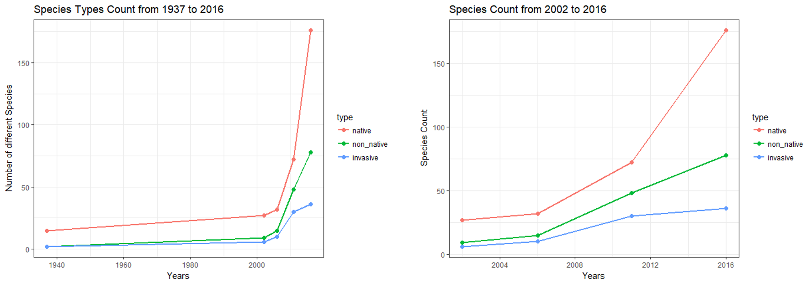
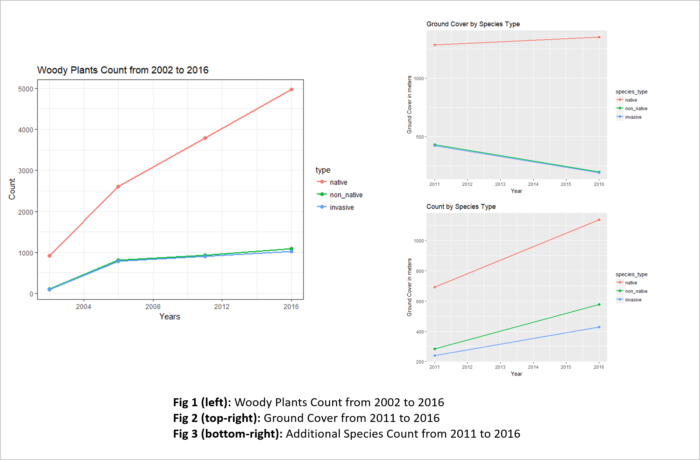
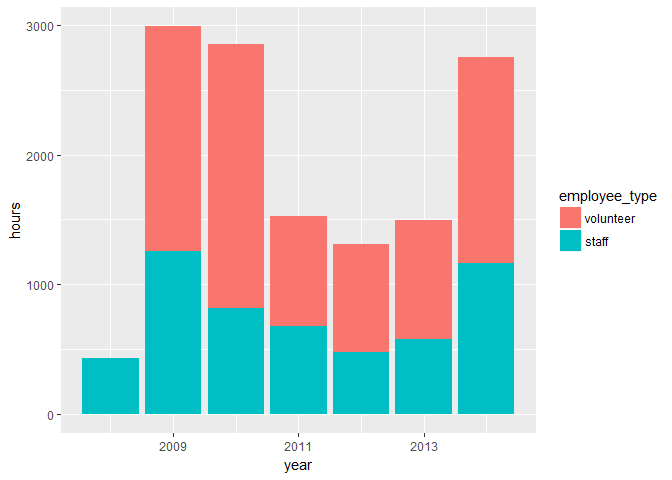
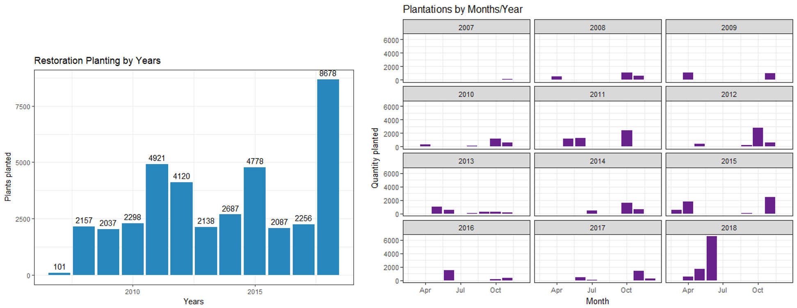
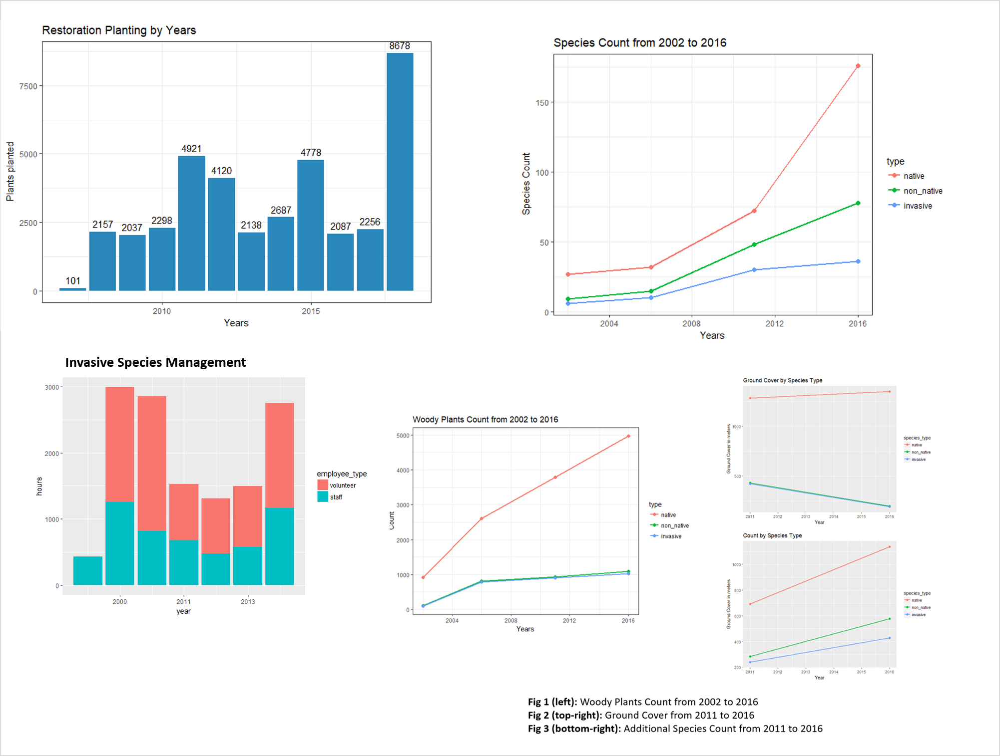

# Summary

**Contents of the document**

* [Audience](#audience)
  * [Decisions that our analysis target](#decisions-that-our-analysis-target)
* [Source Data and Processing](#source-data-and-processing)
* [Research Questions and their answers](#research-questions-and-their-answers)
  * [Species Composition(1937-2016)](#species-composition-(1937-2016))
  * [Management Efforts](#management-efforts)
  * [Impact of Restoration Activities](#impact-of-restoration-activities)
* [References and Word Count](#references)

## Audience

The **New York Botanical Garden (NYBG)** is a National Historical Landmark located in the Bronx, New York City. The site covers 250 acre which is a landscape that supports a diverse flora of millions of plants. (Mission and History, n.d.)

According the NYBG official website; “the New York Botanical Garden is an iconic living museum, a major educational institution, and a renowned plant research and conservation organization. Founded in 1891 and now a National Historic Landmark, it is one of the greatest botanical gardens in the world and the largest in any city in the United States, distinguished by the beauty of its diverse landscape and extensive collections and gardens, as well as by the scope and excellence of its multidisciplinary exhibitions and programs.” (About, n.d.)

NYBG is committed truly committed to the local communities. Throughout the year the garden participate in innovative exhibitions and have several free visitor attractions. For instance, every year in the spring, the Garden has “The Orchid Show, the country’s largest curated exhibition of orchids”. In the winter, they have the “Holiday Train Show” which is “a display of 150 landmarks such as the Brooklyn Bridge, Statue of Liberty, and Rockefeller Center, each re-created with bark, leaves, and other natural materials” (Arts & Humanities, n.d.). Furthermore the garden is very committed to educating the public which enhance the visitor’s experience. “These include music and dance performances; daily tours; home gardening demonstrations; poetry readings; special lectures and symposia; summer concerts; weekend celebrations such as the Daffodil Wine Weekend, Mother’s Day Weekend Garden Party, and Rose Garden Celebration; and evening events, including Orchid Evenings and Bar Car Nights.” (Arts & Humanities, n.d.).

According the NYGB website; their “Adult Education Program is the largest and most diverse continuing education program at any botanical garden in the world, with annual registrations exceeding 9,400 and more than 700 classes offered at the Botanical Garden, the Midtown Education Center in Manhattan, and off-site locations in Dutchess County and Connecticut.” (Arts & Humanities, n.d.) . The Garden also has a nationally accredited School of Professional Horticulture, established in 1932 which offers a two-year, full-time diploma program in horticulture, botany, and landscape design, including native plants, green roofs, urban agriculture, sustainability, greenhouse management, and ecological garden design. (Arts & Humanities, n.d.)

### Decisions that our analysis target

The recent changes (1937 to 2018) in the forest has been well documented and hence has helped in studying the factors that have lead to the decrease in the native species. The invasive species have also been well studied and managed by the Forest Management. There has been efforts to restore the forest, and to manage the overall ecosystem to prevent the invasive species from becoming the dominant species. 

> By studying this data we aim to draw the inference between the restoration initiatives and its impact on the forest composition over time.

From the raw data of 2002 and 2006, it was found out that there was a prominent increase in the number of invasive species - Amur Cocktree (Phellodendron amurense), Japanese angelica tree (Aralia elata) and Amur honeysuckle (Lonicera maackii). Since 2008, the Garden has been actively managing these species in order to reduce their impact on the overall ecosystem (NYBG/125, 2016).

> We aim to analyze the change in the number of the controlled invasive species after the intervention of the Garden management, to see if there is a correlation between the two.

Between 2008 and 2015, the director of NYBG developed an ambitious program of ecological restoration, trail restoration and other programs. There were full time positions of dedicated to restoration activities which included removal of invasive species, planting native species grown from locally collected seeds, managing invasive pests and diseases and restoring the habitat (Schuler and Forrest, 2016). The forest staffs, contractors, and volunteers dedicated a substantial amount of time ~ 24000 hours from 2008 to 2014. 

> We want to analyze the staff hours distribution during this period, and the impact it had towards the area of - restoration planting, invasive plant management and trail maintenance.

## Source Data and Processing

The source files we received covered the below breadth - 

* GIS Data (not used)
* Inventory Data
* Restoration Data

### Inventory Data

Inventory Data provided inventory information like -

* Comprehensive Species Tally (All the species seen with their classification into Native, Non-native and Invasive) (1937, 2002, 2006, 2011, 2016)
* Woody Plant Data (1937, 2002, 2006, 2011, 2016) - Survey of all woody plants in NYBG
* Groundcover Data (2011, 2016) - Survey of the groundcover in (cm) in NYBG
* Additional Species Data (2011, 2016) - Survey of additional species in NYBG

The detailed cleaning report can be found [here](Deliverables/4%20Data%20Cleaning/Data%20Cleaning.md)

### Restoration Data

Restoration Data contains the data around management efforts. These include -

* NYBG Forest Management Data - outlining hours spent by Staffs and Volunteers around variety of tasks.
* NYBG Forest Restoration Planting - with information about the plantings that have been done with other information like - quantity, timestamp, taxon, etc.

## Research Questions and their answers

We had selected three questions that we planned to answer with our analysis. These were -

1. How has the species composition changed over the years (Native, Non-native, Invasive)?

2. How has the management efforts changed over the years?

3. How has the restoration programs impacted with the help of volunteers and staff?

### Species Composition (1937-2016)

**How has the species composition changed over the years (Native, Non-native, Invasive)?**

To make this more meaningful, we have divided the analysis into two phases -

* Number of native, non-native and invasive species found and its variation
* Total count of the native, non-native and invasive species and its variation

#### Number of Species (Diversity of the forest)

There is a wide variety of species that can be found in NYBG. The number of different species that can be found had been increasing for all the three species types (native, non-native and invasive). From the data, the trend we found is given below.

From the period 2002 to 2016, there is a tremendous growth in the total number of species in all the three types - native, non-native and invasive. The rate growth in the number of native species is more prominent, which is evident from the plot, where the slope of the line kept increasing every year. The rate of growth in the number of non-native species increased till 2011, from where it decreased (as the slope of the line graph seems to have decreased slightly). The most **prominent rate of decrease can be found in Invasive species after 2011**. We would be interested in knowing if there are some external factors that might have contributed to this behavior.

#### Total Count of Species (Forest Composition)

Till now, we have discussed about the diversity of the forest, emphasizing on the count of species and its trends over the years. NYBG also has an inventory of all the plants and its coverage. These are based on survey done over the past years and are recorded with timestamp.

The types of plants that we will be analyzing in the further sections are -

- Woody Plants (1937, 2002, 2006, 2011, 2016)
- Ground Cover (2011, 2016)
- Additional Species (2011, 2016)

For **Woody Plants**, native species have seen tremendous growth over the last decade. The growth rate is fairly consistent and healthy for the New York Botanical Gardens. This can be as a result of the restoration planting efforts from the management, which we would look into in the later sections. Even though, there is an increase in the non-native species as well, the rate is much lower than the native species. Invasive species have almost similar growth rates as non-native.

From the **Ground Cover** data, it is obvious that more emphasis is given in the controlling of non-native and invasive species, which have decreased a lot in the last few years. There is a noticeable increase in the native species as well.

The **Additional Species** data seems to not favor either of the three species types. All the three, have witnessed a good increase over the last five years (2011-2016).

### Management Efforts

#### Invasive Species Control Efforts

NYBG undertakes several initiatives to manage the forest. One of them is Invasive Species Control, which can directly impact the growth trends of Invasive Species over the years.

The plot shows us that the hours spent over the years does not have a trend. There has been significant work hours put during the years 2009, 2010 and again in 2014. The range of the time period over which the data was collected is pretty low (2008-2014). Hence we cannot make a correlation with the species count for these years. In future, as this data matures, we would be in a better place to draw correlation between the two.

#### Restoration Efforts

Towards the management goals, there are active restoration projects that have been going on since 2007.

The restoration efforts seem to be very un-even. The years that recorded best efforts are 2011, 2012, 2015 and 2018. For the remaining years, it has been fairly consistent. The highest number of plantings can be seen in June of 2018. All the restorations that have been recorded are either identified as native species or not-identified. For the period till 2016, below is the restoration activities for native species. 

Please note that the actual native species plantings may be much higher than this. The classification of species into native, non-native and invasive has been done on the basis of the most recent Comprehensive Species Tally (2016). Even this record is outdated when compared to the restoration plantings.

### Impact of Restoration Activities

There has been significant improvement in the hours spent by the management of NYBG for restoration of the forest. 

From the above plots we can see -

- Improved diversity of the forest
- Better controlling of invasive species
- Significant improvement in the woody plants count
- Decrease in invasive ground cover

## References

About. (n.d.). Retrieved September 2018, 2018, from New York Botanical Garden: [https://www.nybg.org/](https://www.nybg.org/)

Arts & Humanities. (n.d.). Retrieved September 25, 2018, from New York Botanical Garden: [https://www.nybg.org/about/mission-and-history/connecting-gardening-to-arts-humanities/](https://www.nybg.org/about/mission-and-history/connecting-gardening-to-arts-humanities/)

Forest Program Research. (n.d.). Retrieved September 25, 2018, from New York Botanical Garden: [https://www.nybg.org/garden/forest/visiting-research/](https://www.nybg.org/garden/forest/visiting-research/)

Mission and History. (n.d.). Retrieved September 25, 2018, from New York Botanical Garden: [https://www.nybg.org/about/mission-and-history/](https://www.nybg.org/about/mission-and-history/)

Natural History of the Forest. (n.d.). Retrieved September 25, 2018, from New York Botanical Garden: [https://www.nybg.org/garden/forest/natural-history-of-the-forest/](https://www.nybg.org/garden/forest/natural-history-of-the-forest/)

Old-growth forest. (2018, Auguts 22). Retrieved September 25, 2018, from Wikipedia: [https://en.wikipedia.org/wiki/Old-growth_forest](https://en.wikipedia.org/wiki/Old-growth_forest)

Saving the Plants of the World. (n.d.). Retrieved September 25, 2018, from New York Botanical Garden: [https://www.nybg.org/about/mission-and-history/saving-the-plants-of-the-world/](https://www.nybg.org/about/mission-and-history/saving-the-plants-of-the-world/)

Schuler, J.A. and Forrest, T. A.  2016. Thain Family Forest Program 2008-2025. The New York Botanical Garden. 

Rudnicky, J.L. and M.J. McDonnell. 1989. Forty-Eight Years of Canopy Change in a Hardwood Hemlock Forest in New York City. Torreya 116(1):52-64.

NYBG/25. Thain Family Forest Inventory. June 2016.

### Proofread Statement

This document has been proofread by Harwinder Kaur on December 07, 2018 at 3:09 p.m. 

`Word Count - 2272`